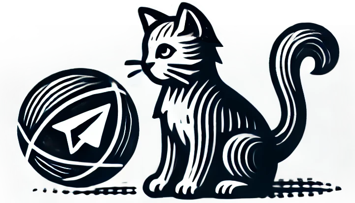

# TelegramKitty
TelegramKitty is a Kotlin Telegram Bot API wrapper with generated Telegram types and methods, a handler DSL, and optional http client.
It is designed for low overhead, predictable concurrency, and fast JVM execution. 
TelegramKitty keeps the programming model direct and easy to reason about, 
with a small API surface and explicit update handling instead of heavy abstraction layers.
And yes, it can send [cat pictures](#cats).

The project is split into two modules:

- `kittybot` - core bot logic, Telegram classes, builder DSL, and custom client SPI
- `kittybot-client` - default Vert.x-based HTTP client
- `samples` - examples

## Features

- Polling and webhook bots
- Generated Telegram Bot API methods and types with official docs for classes and methods
- Dispatcher DSL for handlers
- Conversation API
- Single-thread, multi-thread, and custom update processing
- Filtering allowed update kinds
- Helpers for skipping old updates with `ensureOnlyNewUpdates(...)`
- Custom HTTP client support via `CustomClient` (`KtorCustomClient` included as a reference implementation)
- Built-in cat helpers via `sendCatPicture(...)`, `sendTheCatApi(...)`, `sendHttpCat(...)`, and `sendTextCat()`

## Installation

Use the default Vert.x client:

```kotlin
dependencies {
    implementation("org.bezsahara:kittybot:2.1.0")
    implementation("org.bezsahara:kittybot-client:2.1.0")
}
```

If you want to provide your own HTTP client, `kittybot-client` is not required:

```kotlin
dependencies {
    implementation("org.bezsahara:kittybot:2.1.0")
}
```

## Polling Example

```kotlin
val bot = KittyBot<PollingReceiver> {
    token = System.getenv("BOT_TOKEN")
    ensureOnlyNewUpdates()

    dispatchers {
        text("/start") {
            bot.sendMessage(chatId, "Hi, ${message.chat.firstName}")
        }
    }
}

bot.startPolling()
```

## Conversation Example

```kotlin
val bot = KittyBot<PollingReceiver> {
    token = System.getenv("BOT_TOKEN")
    ensureOnlyNewUpdates()

    dispatchers {
        buildConversation {
            onStartCommand {
                bot.sendMessage(chatId, "Hi! What's your name?")
                val name = receiveText().await()

                bot.sendMessage(chatId, "Send a picture, $name")
                val picture = receivePhotos().await()
            }
        }
    }
}

bot.startPolling()
```

## Webhook Example

```kotlin
val token = System.getenv("BOT_TOKEN")

val bot = KittyBot<WebhookReceiver> {
    this.token = token

    webhook(
        url = "https://example.com/telegram/$token",
        deletePreviousWebhook = true
    )

    dispatchers {
        text("/start") {
            bot.sendMessage(chatId, "Hi from webhook mode")
        }
    }
}

bot.start()

// Pass raw Telegram webhook payloads into the bot from your server:
// bot.onUpdate(payload)
```

## Custom Clients

If you do not want the default Vert.x transport, provide your own client with `useCustomClient(...)` or `setClientBuilder(...)`.

`kittybot` also includes `KtorCustomClient` as a ready-made `CustomClient` implementation. If you use it, add your own Ktor client dependencies and engine:

```kotlin
dependencies {
    implementation("org.bezsahara:kittybot:2.1.0")
    implementation("io.ktor:ktor-client-core:3.4.0")
    implementation("io.ktor:ktor-client-cio:3.4.0")
}
```

```kotlin
val bot = KittyBot<PollingReceiver> {
    token = System.getenv("BOT_TOKEN")
    useCustomClient(
        KtorCustomClient(
            HttpClient(CIO)
        )
    )

    dispatchers {
        text("/start") {
            bot.sendMessage(chatId, "Running on a custom client")
        }
    }
}
```

The custom client SPI receives absolute Telegram method URLs, so your implementation only needs to send requests and return raw responses.

## Update Processing

The default updater mode is `UpdaterMode.SingleThread`. You can also switch to:

- `UpdaterMode.MultiThread(...)`
- `UpdaterMode.Custom(...)`

For example:

```kotlin
updaterMode = UpdaterMode.MultiThread(MultiIdentity.OfChatIdentity, parallelism = 32)
```

## Just The API Client

If you only need Telegram API calls without the handler system, use `createTelegramBot(...)`.

## Cats

Cat helpers live in [cats.kt](kittybot-client/src/main/kotlin/org/bezsahara/kittybot/bot/cats.kt) and are available when you use the default Vert.x client module.

```kotlin
text("/cat") {
    bot.sendCatPicture(chatId)
}

text("/cat_says") {
    bot.sendCatPicture(chatId, "TelegramKitty")
}

text("/httpcat") {
    bot.sendHttpCat(chatId, 404)
}
```

## More Examples

See [samples](samples/src/main/kotlin) for polling, webhook, and handler examples.

# License
Copyright 2026 Hlib Korol

Permission is hereby granted, free of charge,
to any person obtaining a copy of this software and
associated documentation files (the "Software"),
to deal in the Software without restriction,
including without limitation the rights to use, copy, modify,
merge, publish, distribute, sublicense, and/or
sell copies of the Software, and to permit persons
to whom the Software is furnished to do so, subject
to the following conditions:

The above copyright notice and this permission notice
shall be included in all copies or substantial portions
of the Software.

THE SOFTWARE IS PROVIDED "AS IS", WITHOUT WARRANTY OF ANY KIND,
EXPRESS OR IMPLIED, INCLUDING BUT NOT LIMITED TO THE WARRANTIES
OF MERCHANTABILITY, FITNESS FOR A PARTICULAR PURPOSE AND NONINFRINGEMENT.
IN NO EVENT SHALL THE AUTHORS OR COPYRIGHT HOLDERS BE LIABLE FOR
ANY CLAIM, DAMAGES OR OTHER LIABILITY, WHETHER IN AN ACTION OF
CONTRACT, TORT OR OTHERWISE, ARISING FROM, OUT OF OR IN CONNECTION
WITH THE SOFTWARE OR THE USE OR OTHER DEALINGS IN THE SOFTWARE.
