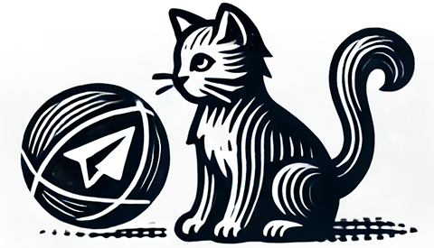

# What is it?
TelegramKitty is a fun and user-friendly Koltin Telegram bot library that makes it easy to access all API methods and types, with names that match the official API.
Documentation is also included for all types and methods (was copied from telegram's website). 

# How to use this?
First, you will need to install it:
```kotlin
dependencies {
    implementation("org.bezsahara:kittybot:1.0.1")
}
```
A simple program would look like:
```kotlin
KittyBot<PollingReceiver> {
    this.token = "your_token"
    dispatchers {
        text("/start") {
            bot.sendMessage(chatId, "Hi, ${message.chat.firstName}")
        }
    }
}.startPolling()
```
And more examples are located in [samples](samples/src/main/kotlin) folder.

## Polling and Webhooks
KittyBot supports both polling and webhooks.

## Cats
It includes several methods to send cat pics) You can find them in [cats.kt](kittybot/src/main/kotlin/org/bezsahara/kittybot/bot/cats.kt)

# License
Copyright 2024 Hlib Korol

Permission is hereby granted, free of charge, 
to any person obtaining a copy of this software and
associated documentation files (the “Software”), 
to deal in the Software without restriction, 
including without limitation the rights to use, copy, modify,
merge, publish, distribute, sublicense, and/or
sell copies of the Software, and to permit persons
to whom the Software is furnished to do so, subject 
to the following conditions:

The above copyright notice and this permission notice 
shall be included in all copies or substantial portions of the Software.

THE SOFTWARE IS PROVIDED “AS IS”, WITHOUT WARRANTY OF ANY KIND,
EXPRESS OR IMPLIED, INCLUDING BUT NOT LIMITED TO THE WARRANTIES
OF MERCHANTABILITY, FITNESS FOR A PARTICULAR PURPOSE AND NONINFRINGEMENT.
IN NO EVENT SHALL THE AUTHORS OR COPYRIGHT HOLDERS BE LIABLE FOR 
ANY CLAIM, DAMAGES OR OTHER LIABILITY, WHETHER IN AN ACTION OF 
CONTRACT, TORT OR OTHERWISE, ARISING FROM, OUT OF OR IN CONNECTION
WITH THE SOFTWARE OR THE USE OR OTHER DEALINGS IN THE SOFTWARE.
